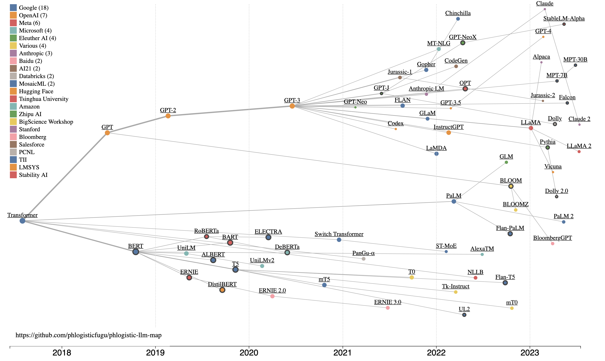

I've been catching up on the latest developments in Large Language Models (LLMs)
and I like to use visual maps.  So I made a 
[data-driven dynamic LLM lineage map](https://phlogisticfugu.github.io/phlogistic-llm-map/)
([source code](https://github.com/phlogisticfugu/phlogistic-llm-map))
to suit my needs.  Hopefully, you find it useful too:

While I do love to build things, I love to build things that provide useful value even more. So I first took a look at
[some](https://arxiv.org/abs/2303.18223) of the
[existing](https://github.com/Mooler0410/LLMsPracticalGuide)
visualizations that others have done.  The reasons I made my own are:

- Be data-driven.  As more new models come out, or corrections are made I want a visualization that automatically adapts to change.
- Link to the source.  To serve as a map to learning, navigation is essential.
- Visualize data densely.  Many properties of each model are shown in the same image.

## Build - Data

To create this map, I first started by collecting data.  I started with some of the notes that I've been keeping on
breakthrough models and their associated papers.  There are
[several](https://a16z.com/2023/05/25/ai-canon/#section--6)
[great](https://crfm.stanford.edu/helm/latest/)
resources out there that list major models.  There were also some of the other visualizations used as a starting point.

It quickly became clear that I needed some working criteria for what it takes to be a major model:

- Large Language Model - Deep learning transformer language models big enough to show [emergent abilities](https://arxiv.org/abs/2206.07682)
- Models used in a paper with a lot of citations
- Models that have gotten a lot of LLM buzz (a web search turns up a ton of results)
- Models that directly led to one of the above major models (referenced in the paper on the major model)
- X-factor: Models/papers that I found interesting

As in any data science work, I had to deal with unclean data.  Here's some of what I did to try to make this as clean as possible:

- Use preprint ([arXiv](https://arxiv.org/)) URLs used as the "authoritative" paper where available, otherwise fallback to blog URLs. Because this space is moving quickly, not all papers have been published in peer-reviewed journals, and many of the recent models seem to not bother with formal papers at all.
- Use the "first submission date" as the date of the model.  That is when the preprint paper was first submitted, or a blog post was first made about a new model.  This is an attempt to get to a standard date for when a model was intentionally publicized.
- Show model lineage based on explicit references by model authors.  Take an educated guess for others.

I then collected this data in a [CSV file](https://github.com/phlogisticfugu/phlogistic-llm-map/blob/main/models.csv) in my git repo.

## Build - Visualization

I wanted a map that shows:

- Model lineage - The story of modern LLMs is one of relatively open inspiration, and competition.  When a new model is made that shows improved performance, it inspires and informs new models.
- Chronology - The timeline of when various models were released is an important part of the story.
- Influence - Some models are a "bigger deal" than others - and I try to use Google Scholar citations as a proxy for that.

As a polyglot full-stack web developer and data scientist, I've
[built](https://ggplot2.tidyverse.org/)
[many](https://plotly.com/javascript/)
[data](https://www.highcharts.com/demo)
[visualizations](https://matplotlib.org/)
[before](https://www.chartjs.org/). So I knew that unfortunately there wouldn't be an "out of the box" solution for exactly what I had in mind.  So I
fired up the tool for bespoke data visualizations: [D3.js](https://d3js.org/).

D3.js is powerful, but it can also be a bit unintuitive and complicated to use.  To build this faster
I used two LLMs: [Github Copilot](https://github.com/features/copilot) and the OpenAI ChatGPT Code Interpreter.  I found that the best way to use their strengths
and avoid their weaknesses was to do the following:

- Ask ChatGPT how to implement a given step (giving it the current code each time) using technical language.  Then implement ChatGPT's code changes in Visual Studio Code
- Use Copilot autocomplete to assist in refactors and tweaking the visualization - while of course only using sensible code suggestions made by Copilot
- Take many small steps, evaluating the visualization along the way.  At each step use Google (still useful) to understand the code being suggested by ChatGPT. This kept each change I made "stable" and permitted "continuous refactoring" as part of keeping the code clean and easily interpretable by the next round of ChatGPT changes. Also, on a few occasions, ChatGPT output code that ended up implementing a bug, and having clean code helped me to debug those issues.

The result is a visualization that implements a [D3.js force simulation](https://d3js.org/d3-force/simulation) to move nodes representing each model into the right location on the visualization according to the rules (forces) specified in the code.  I also implemented colors for each publisher, larger nodes corresponding to larger numbers of citations, wider links to
represent major branches, links to source materials about a given model, and hover tooltip information for each node.

## Share

With this blog post, I am releasing "v1" of this visualization to all who may find it useful.  I intend on keeping this up to date with new models as they come out.  If anyone has any
corrections or suggested changes, the data and the visualization are open source, and contributions are welcome.

Hopefully, you can also use this map to learn about and be inspired by new LLMs, and all the people who make them.
