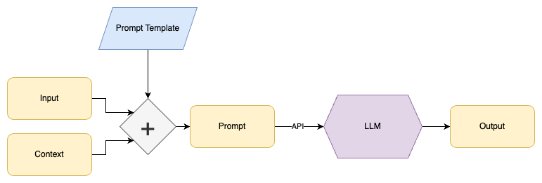

One of the surprising and exciting use-cases for Large Language Models (LLMs) is that they can be used to automate
many tasks that can be described in words.  However, using LLMs to then scale that work hundreds or thousands of times
can quickly become tedious and slow.  We've created a new Python package: [parallel-parrot](https://pypi.org/project/parallel-parrot/) which makes this process easy and robust.


*Photo by [Gareth Davies](https://unsplash.com/@gdfoto?utm_source=unsplash&utm_medium=referral&utm_content=creditCopyText)
 on [Unsplash](https://unsplash.com/photos/EGcfyDiUv58?utm_source=unsplash&utm_medium=referral&utm_content=creditCopyText)* 

### The Task

The most common way that people are now using LLM's to generate outputs is to use a prompt template, and adding appropriate context in what is called [prompt engineering](https://www.promptingguide.ai/):



The idea is that a prompt template is designed that will take in an `input` and 
`context`, and use that to generate a text `prompt`.  This then gives the LLM the instructions it needs to generate the type of output desired.

For example, if I wanted to shorten long documents while keeping their meaning, I might design a prompt template like:

```
Generate a concise summary of the following document, using the context provided:
context: ${context}
document: ${document}
```

Then use [code](https://peps.python.org/pep-0292/) to replace `${context}` with each context I want to use, and replace `${document}` with the text of each document I want to process.
The same prompt template can then be used to summarize company blog posts for social media, while adding some context about the company itself.
Or it could be used to summarize technical documents for different audiences, who may start at different levels of understanding.

### Generating Data

We've found that as one gets to more advanced use-cases, that the outputs that you want from the LLM inevitably become more complicated.  For example:

- Using a long document to generate several "Frequently Asked Questions", in question and answer pairs
- Parsing a document for multiple topics, and evaluate the sentiment (POSITIVE, NEUTRAL, or NEGATIVE) of each topic
- Identifying corporate entities in a document, and the role for each of them in the document (vendor, client, etc)

For this one can leverage two features provided by modern LLM APIs:
- structured output prompting: For OpenAI, this is the ("function calling")[https://platform.openai.com/docs/guides/gpt/chat-completions-api] feature, but really it is about modifying the prompt to request multiple outputs, formatted in a manner that is machine-readable (JSON)
- the number of "choices" to create in an output (`n`).  This can be useful for leveraging the "creativity" of an LLM efficiently.  Process the same inputs, but ask the LLM to generate multiple outputs with random variations


For example, say I use the prompt template:
```
Generate question and answer pairs from the following document.
Output a list of JSON objects with keys "question" and "answer".
Only output questions and answers clearly described in the document.
document: ${text}
```

This could turn a [wikipedia page about George Washington](https://en.wikipedia.org/wiki/George_Washington) into a list of question and answer pairs:

```json
[
  {
    "question": "Who was the first president of the United States?",
    "answer": "George Washington"
  },
  {
    "question": "What position did George Washington hold during the American Revolutionary War?",
    "answer": "Commander of the Continental Army"
  },
  {
    "question": "What document did George Washington help draft and ratify?",
    "answer": "The Constitution of the United States"
  },
]
```

These question and answer pairs could then be used to:
- create a new document of "Frequenty Asked Questions"
- make the content easier to skim for a reader
- store the questions in a search database, with a reference to the original document, to make it easier to match questions with the documents that answer them, even if the questions are phrased using different words.

### Scale

All of the above is great and useful, and done before, however things can get tricky when you try to scale.  A single response to a decently complicated prompt could take up to 30 seconds.  That means processing a thousand documents one after the other (in series) could take over 8 hours.

To help with this, we created a python package: [parallel-parrot](https://pypi.org/project/parallel-parrot/) that makes LLM calls in parallel, without having to worry about concurrency, retries, API throttling, and other related issues.  Parallelization can accomplish the same 8+ hour task in minutes.

Series vs Parallel:


parallel-parrot automatically:
- takes in a pandas dataframe or native Python list of dictionaries
- applies a prompt template to create a prompt per row
- queries an API-based LLM in parallel, handling automatic retries and rate limiting
- parses and dedupes the outputs from multiple choices, and from JSON outputs
- outputs clean ([exploded](https://towardsdatascience.com/why-and-how-to-explode-a-list-like-column-to-rows-in-pandas-b69c3391c01c/) / [tidy](https://cran.r-project.org/web/packages/tidyr/vignettes/tidy-data.html) ) data in the original format

So it can take in multiple rows of input data:

```json
[
    {
        "text": "George Washington (February 22, 1732 - December 14, 1799) was ...",
        "source_url": "https://en.wikipedia.org/wiki/George_Washington",
    },
    {
        "text": "John Adams (October 30, 1735 - July 4, 1826) was ...",
        "source_url": "https://en.wikipedia.org/wiki/John_Adams",
    },
]

```

Then use a few lines of Python:

```python
import parallel_parrot as pp

config = pp.OpenAIChatCompletionConfig(
    openai_api_key="*your API key*",
    n=3,
    system_message="you are a very precise assistant",
)

(output, usage_stats) = pp.run_async(
    pp.parallel_data_generation(
        config=config,
        input_data=input_data,
        prompt_template="""
Generate question and answer pairs from the following document.
Output a list of JSON objects with keys "question" and "answer".
Only output questions and answers clearly described in the document.
If there are no questions and answers, output an empty list.
document: ${text}
        """,
        output_key_names=["question", "answer"]
    )
)
```

And output generated question/answer pairs that also retain the information about the inputs they refer to.

```json
[
  {
    "text": "...",
    "source_url": "https://en.wikipedia.org/wiki/George_Washington",
    "question": "Who was the first president of the United States?",
    "answer": "George Washington"
  },
  {
    "text": "...",
    "source_url": "https://en.wikipedia.org/wiki/George_Washington",
    "question": "What position did George Washington hold during the American Revolutionary War?",
    "answer": "Commander of the Continental Army"
  },
  {
    "text": "...",
    "source_url": "https://en.wikipedia.org/wiki/George_Washington",
    "question": "What document did George Washington help draft and ratify?",
    "answer": "The Constitution of the United States"
  },
  {
    "text": "...",
    "source_url": "https://en.wikipedia.org/wiki/John_Adams",
    "question": "Who were some important contemporaries that John Adams corresponded with?",
    "answer": "Adams regularly corresponded with important contemporaries, including his wife and adviser Abigail Adams and his friend and political rival Thomas Jefferson."
  },
  {
    "text": "...",
    "source_url": "https://en.wikipedia.org/wiki/John_Adams",
    "question": "Who was John Adams?",
    "answer": "John Adams was an American statesman, attorney, diplomat, writer, and Founding Father."
  },
]
```

Under the hood, the package uses the high-performance [aiohttp](https://docs.aiohttp.org/en/stable/) package.  And uses the efficient I/O library [libuv](https://libuv.org/) via [uvloop](https://github.com/MagicStack/uvloop).  It also adapts to different connection timeouts and retries using best-practices such as exponential backoff with jitter.

Depending on the API-based LLM you are using, some require time to "warm up" machines in the cloud, and others like OpenAI have [rate limits](https://platform.openai.com/docs/guides/rate-limits/rate-limits-in-headers) which can vary depending on account tier.  The package handles this by first making a "setup" request, which is then used to configure and optimize the following bulk parallel requests.  That initial request also makes it easier to debug show-stopper issues like invalid credentials or API downtime.


### Next Steps

We're open sourcing this [package](https://github.com/novex-ai/parallel-parrot) in the true spirit of open source: in the hopes that others find it useful as well.  Contributions and feedback are welcome, in the hopes that we can help each other unlock more of the value from this exciting new technology.

Also, to meet the needs of clients who have come to us interested in effectively leveraging Generative AI for themselves, we just formalized a new company [Novex AI](https://novex.ai/) to help with that.
