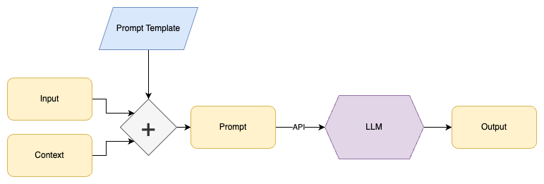

Large Language Models (LLMs) have revolutionized task automation, yet scaling these
operations poses challenges in efficiency and reliability.
We've developed [parallel-parrot](https://pypi.org/project/parallel-parrot/)
, a Python package that parallelizes LLM tasks to boost performance and reliability.

### Task Automation with Prompt Templates

To instruct the LLM about the task we wish to perform, we use prompt templates
developed using [prompt engineering](https://www.promptingguide.ai/)



The idea is to design a prompt template that will take in an `input` and 
`context`, and use that to generate a text `prompt`.  This then gives the LLM the instructions it needs to generate the type of output desired.

For example, to shorten long documents while keeping their meaning, design a prompt template like:

```
Generate a concise summary of the following document, using the context provided:
context: ${context}
document: ${document}
```

We then use [code](https://peps.python.org/pep-0292/) to replace `${context}` with each context and replace `${document}` with the text of each document being processed.
The same prompt template serves many purposes. From summarizing company blog posts, to making meeting notes easier to review.  And it does so while injecting appropriate business context.

### Generating Data

We've found that as one gets to more advanced use-cases, that the outputs that you want from the LLM inevitably become more complicated.  For example:

- Using a long document to generate several "Frequently Asked Questions", in question and answer pairs
- Parsing a document for multiple topics, and infer the sentiment (POSITIVE, NEUTRAL, or NEGATIVE) of each topic
- Identifying corporate entities in a document, and the role for each of them in the document (vendor, client, etc)

For this we can leverage two features provided by modern LLM APIs:
- __JSON-formatted outputs__: Allows for easier parsing.  For OpenAI, this is the ["function calling"](https://platform.openai.com/docs/guides/gpt/chat-completions-api) feature
- __Multiple Choices__:  Generate multiple different outputs for each request.  This can make it more likely that one of the outputs best matches the goal you are trying to achieve.  For OpenAI, this is specified by setting the number of choices (`n`) to be greater than one.


For example, say we use the prompt template:
```
Generate question and answer pairs from the following document.
Output a list of JSON objects with keys "question" and "answer".
Only output questions and answers clearly described in the document.
document: ${text}
```

This could turn a [wikipedia page about George Washington](https://en.wikipedia.org/wiki/George_Washington) into a list of question and answer pairs:

```json
[
  {
    "question": "Who was the first president of the United States?",
    "answer": "George Washington"
  },
  {
    "question": "What position did George Washington hold during the American Revolutionary War?",
    "answer": "Commander of the Continental Army"
  },
  {
    "question": "What document did George Washington help draft and ratify?",
    "answer": "The Constitution of the United States"
  },
]
```

These question and answer pairs could then be used to:
- Create a new document of "Frequenty Asked Questions"
- Make the content easier to skim for a reader
- Improve search database matches.  User questions typically match more closely to LLM generated questions than to original documents.

### Scale

The above is powerful, but it starts to get tricky when you try to scale to thousands of tasks.  Processing a thousand documents one after the other (in series) could take over 8 hours.  And if there is an API or network error near the end, it could force you to start all over.

To address this, we created a python package: [parallel-parrot](https://pypi.org/project/parallel-parrot/) which makes LLM calls in parallel.  It deals with all the issues related to concurrency, retries, API throttling, and other low-level concerns.  Parallelization reduces the total time for processing a thousand documents from hours to minutes.

Series vs Parallel:


[parallel-parrot](https://pypi.org/project/parallel-parrot/) automatically:
- Takes in a pandas dataframe or native Python list of dictionaries
- Applies a prompt template to create a prompt per row
- Queries an API-based LLM in parallel, handling automatic retries and rate limiting
- Parses and dedupes the outputs from multiple choices, and from JSON outputs
- Outputs clean ([exploded](https://towardsdatascience.com/why-and-how-to-explode-a-list-like-column-to-rows-in-pandas-b69c3391c01c/) / [tidy](https://cran.r-project.org/web/packages/tidyr/vignettes/tidy-data.html) ) data in the original format

For example, it can take in multiple rows of input data:

```json
[
    {
        "text": "George Washington (February 22, 1732 - December 14, 1799) was ...",
        "source_url": "https://en.wikipedia.org/wiki/George_Washington",
    },
    {
        "text": "John Adams (October 30, 1735 - July 4, 1826) was ...",
        "source_url": "https://en.wikipedia.org/wiki/John_Adams",
    },
]

```

Then use a few lines of Python:

```python
import parallel_parrot as pp

config = pp.OpenAIChatCompletionConfig(
    openai_api_key="*your API key*",
    n=3,
    system_message="you are a very precise assistant",
)

(output, usage_stats) = pp.run_async(
    pp.parallel_data_generation(
        config=config,
        input_data=input_data,
        prompt_template="""
Generate question and answer pairs from the following document.
Output a list of JSON objects with keys "question" and "answer".
Only output questions and answers clearly described in the document.
If there are no questions and answers, output an empty list.
document: ${text}
        """,
        output_key_names=["question", "answer"]
    )
)
```

To generate useful question and answer pairs:

```json
[
  {
    "text": "...",
    "source_url": "https://en.wikipedia.org/wiki/George_Washington",
    "question": "Who was the first president of the United States?",
    "answer": "George Washington"
  },
  {
    "text": "...",
    "source_url": "https://en.wikipedia.org/wiki/George_Washington",
    "question": "What position did George Washington hold during the American Revolutionary War?",
    "answer": "Commander of the Continental Army"
  },
  {
    "text": "...",
    "source_url": "https://en.wikipedia.org/wiki/George_Washington",
    "question": "What document did George Washington help draft and ratify?",
    "answer": "The Constitution of the United States"
  },
  {
    "text": "...",
    "source_url": "https://en.wikipedia.org/wiki/John_Adams",
    "question": "Who were some important contemporaries that John Adams corresponded with?",
    "answer": "Adams regularly corresponded with important contemporaries, including his wife and adviser Abigail Adams and his friend and political rival Thomas Jefferson."
  },
  {
    "text": "...",
    "source_url": "https://en.wikipedia.org/wiki/John_Adams",
    "question": "Who was John Adams?",
    "answer": "John Adams was an American statesman, attorney, diplomat, writer, and Founding Father."
  },
]
```

Under the hood, it uses the high-performance [aiohttp](https://docs.aiohttp.org/en/stable/) package.  And uses the efficient I/O library [libuv](https://libuv.org/) via [uvloop](https://github.com/MagicStack/uvloop).  It also uses best practices such as exponential backoff with jitter to deal with connection timeouts and retries.

Depending on the API-based LLM you are using, some require time to "warm up" machines in the cloud.  Other APIs like OpenAI have [rate limits](https://platform.openai.com/docs/guides/rate-limits/rate-limits-in-headers) which can vary depending on account tier.  The package handles both of these by first making a "setup" request.  That request is used to configure and optimize the main parallel requests.  That same initial request also makes it easier to debug show-stopper issues like invalid credentials or API downtime.


### Next Steps

We're open sourcing this [package](https://github.com/novex-ai/parallel-parrot) in the true spirit of open source: in the hopes that others find it useful as well.  Contributions and feedback are welcome, in the hopes that we can help each other unlock more of the value from this exciting new technology.

Ready to implement Generative AI in your own company operations?  Contact us at 
[Novex AI](https://novex.ai/) to tailor an effective solution that fits your needs.
