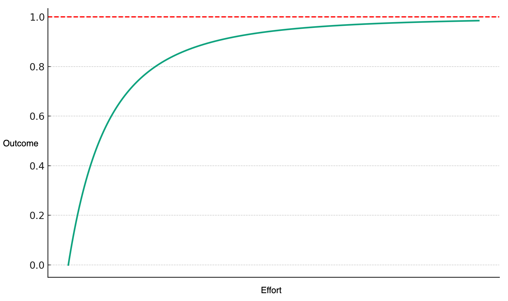
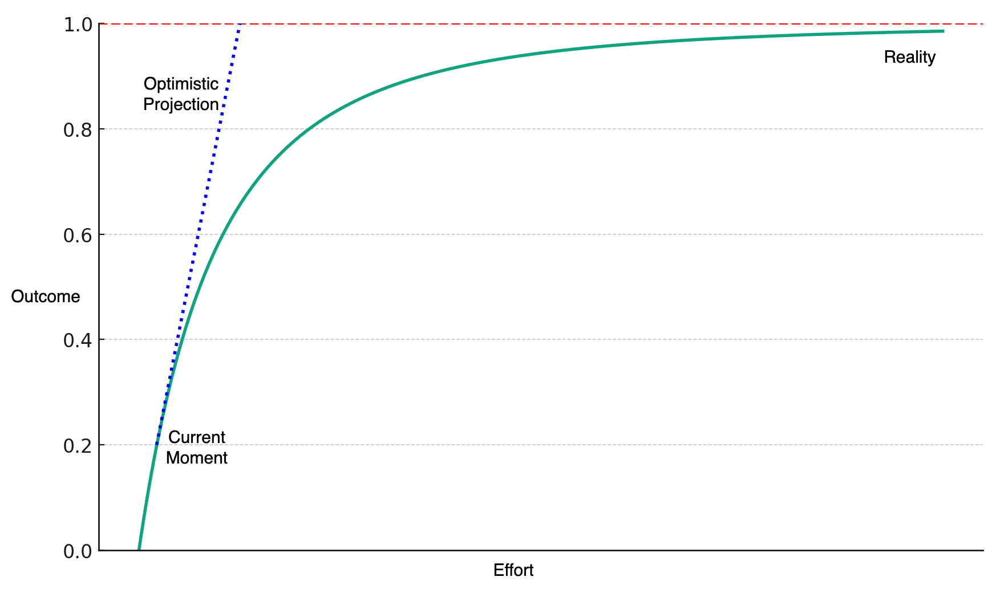

Many of the most buzzy use-cases for Generative AI are doomed, and the people working on those projects don't yet know it.  Here's why:

## The Reverse Pareto Principle Problem

The [Pareto Principle](https://en.wikipedia.org/wiki/Pareto_principle), otherwise known as the 80/20 rule, states
that about 80% of the outcome comes from 20% of the effort.  It's an observed behavior of many complex systems.

In technology, it is often used optimistically, that if one can figure out the right 20% of effort, with say a tech
startup working on an innovative problem, that you can have an outsized 80% outcome.  For example, a lot of the exciting outcomes in Generative AI are "80% solutions": often amazing and useful, but sometimes embarassingly wrong.

The problem is the Reverse Pareto Principle: that the remaining 20% of the outcome will require an extra 80% of the effort.  In fact, it's even worse than that.  The actual
statistical
[Pareto Distribution](https://en.wikipedia.org/wiki/Pareto_distribution) never actually gets to 100%:

A lot of exciting progress has been made in Generative AI in a very short amount of time.
Chatbots can draft content that looks better than what most people can write.  And AI can create images that look realistic and better than what most people can draw.

To catch on to this new technology, many people are investing time and money based on optimistic projections of the current progress.  They are betting that based on the current
rate of progress, more resources will get them to 100% faster than others, and they can own a whole new market.

The problem is that those optimistic projections will not match reality:

There will be more and more hard problems that take a lot of effort in order to move the needle the next 1%.  We're already seeing some of these problems in hallucinations, model safety and security, and difficulties in [performance measurement](https://www.anthropic.com/index/evaluating-ai-systems).

## Strategic Solution

For those who want results sooner rather than later, from my experience in the last AI hype cycle, the solution is to "move the goalpost and claim victory".

_Photo by [Adam Winger](https://unsplash.com/@awcreativeut) on [Unsplash](https://unsplash.com/photos/GIFlfKX23rc?utm_content=creditCopyText&utm_medium=referral&utm_source=unsplash)_

Look for use-cases that do not require that the model be correct 100% of the time.  But instead where being correct 80% of the time is useful.  For example:

- Instead of an AI professional (lawyer, doctor, engineer, analyst, etc), make a copilot/assistant that helps those professionals be more efficient
- Instead of trying to replace customer service people with AI, use internal-facing AI to make your service people more productive
- Instead of trying to make an AI that [knows everything](https://bard.google.com/), make tools that help knowledge-seekers.
- Instead of a fully [self-driving car](https://www.theverge.com/2023/8/23/23837598/tesla-elon-musk-self-driving-false-promises-land-of-the-giants), deliver a working driver assistance system
- Instead of a 10 year prediction of the future, use a 1-year prediction to optimize short-term actions (from my time at [Retina AI](https://retina.ai) using predicted LTV to optimize marketing)

When I was at [Topaz Labs](https://www.topazlabs.com/) I saw how instead of following the hype at the time (AI for image recognition), using the same technology for a different use-case (AI for image enhancement) could let one deliver a practical product that delivers
real value.  The difference is to look for places where, if the AI produces the wrong output, the cost of being wrong is small.

_Caveat Emptor_ - Eventually, with enough effort, new technologies can become reliable.
Airplanes eventually developed commercially, it just wasn't the [Wright Brothers](https://en.wikipedia.org/wiki/Wright_brothers) who benefitted.

## More

If this sort of strategic thinking on AI and practical solutions interests you, we started
[Novex AI](https://novex.ai/) to help companies deliver real value via AI and machine learning.
